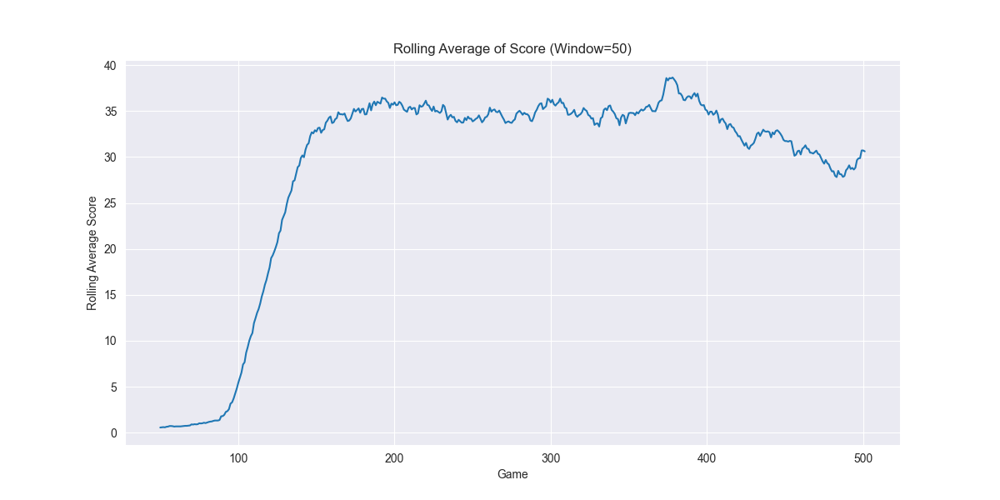
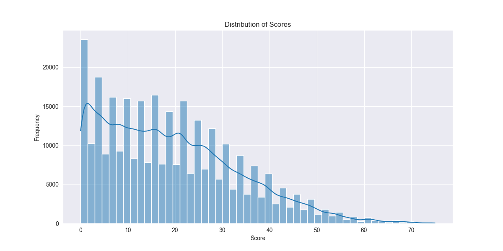
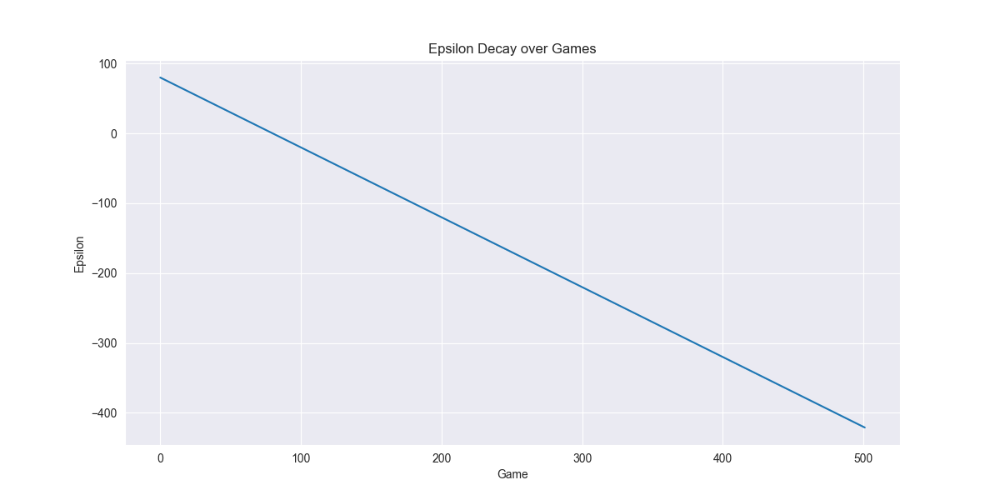
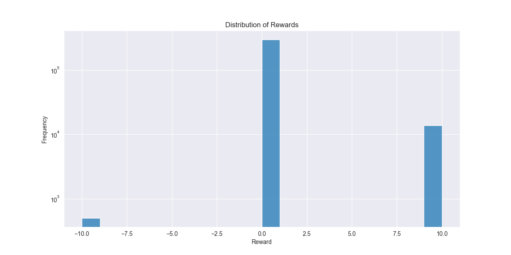
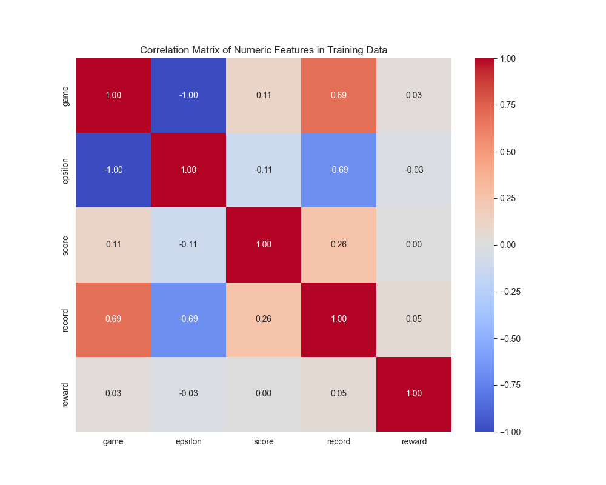

# AI Snake Game using Deep Q-Learning

This project is an implementation of a Reinforcement Learning agent that learns to play the classic Snake game. The agent is built using a Deep Q-Network (DQN) with PyTorch and interacts with a custom game environment built with Pygame.


***

##  Key Features
-   **Deep Q-Learning Model**: A neural network built with PyTorch learns to predict the best action based on the game state.
-   **Custom Game Environment**: A fully functional Snake game built from scratch using Pygame.
-   **Experience Replay**: Implements a memory buffer for the agent to learn from a diverse set of past experiences, stabilizing the training process.
-   **Live Performance Tracking**: Training progress, including scores and other metrics, is plotted in real-time with Matplotlib.
-   **Model Persistence**: The trained model weights are saved, allowing you to load them later to see the trained agent in action.
-   **Detailed Analysis**: Comes with a Jupyter Notebook for in-depth analysis of the agent's performance post-training.

***

##  Training Results & Analysis

The agent was trained over thousands of games, and its performance was tracked to validate the learning process. The plots below showcase the agent's ability to improve its score and strategy over time.

### **Performance Over Time**
The rolling average score shows a clear upward trend, demonstrating that the agent is successfully learning to survive longer and score more points.



### **Score Distribution**
This histogram shows the frequency of final scores achieved by the agent. After training, the distribution shifts towards higher scores.



### **Epsilon-Greedy Strategy**
The exploration rate (epsilon) systematically decreases, forcing the agent to shift from random exploration to exploiting its learned knowledge.



### **Advanced Analysis**
Further analysis reveals insights into the rewards and correlations between different game state variables.




***

## ## Technology Stack
-   **Python 3.13**
-   **PyTorch**: For building and training the deep neural network.
-   **Pygame**: For creating the interactive Snake game environment.
-   **NumPy**: For efficient array manipulation and numerical operations.
-   **Matplotlib**: For plotting and visualizing training data.
-   **Jupyter Notebook**: For post-training analysis.

***

##  Setup and Installation

Follow these steps to get the project running on your local machine.

1.  **Clone the Repository**
    ```bash
    git clone [https://github.com/Jalpan04/ai_snake_training.git](https://github.com/Jalpan04/ai_snake_training.git)
    cd ai_snake_training
    ```

2.  **Create and Activate a Virtual Environment (Recommended)**
    ```bash
    # Create the environment
    python -m venv venv

    # Activate on Windows
    venv\Scripts\activate
    ```

3.  **Install Dependencies**
    First, create a `requirements.txt` file with the content below. Then, run the installation command.

    **`requirements.txt`:**
    ```txt
    torch
    pygame
    numpy
    matplotlib
    ipython
    ```

    **Installation Command:**
    ```bash
    pip install -r requirements.txt
    ```

***

##  How to Use

#### **1. Train the Agent**
To start the training process from scratch, run the `train.py` script. The model weights will be saved automatically to `model/model.pth`. Training progress will be plotted live.
```bash
python train.py
````

#### **2. Test the Trained Agent**

To watch your pre-trained agent play the game, run the `test.py` script. This will load the saved model from the `model` directory and run the game at high speed without any learning.

```bash
python test.py
```

-----

##  Project Structure

```
.
├── agent.py            # Contains the Agent class, memory, and learning logic.
├── model.py            # Defines the PyTorch neural network architecture (DQN).
├── train.py            # Main script to instantiate the agent and run the training loop.
├── snake_game.py       # The Pygame-based game environment logic.
├── helper.py           # Utility functions for plotting results.
├── test.py             # Script to test and visualize a trained agent's performance.
├── analysis.ipynb      # Jupyter Notebook for in-depth performance analysis.
├── model/              # Directory for saved model weights (.pth file).
├── *.png               # PNG files of plots generated during analysis.
└── README.md           # This file.
```

-----

## \#\# License

This project is licensed under the MIT License. See the `LICENSE` file for details.

